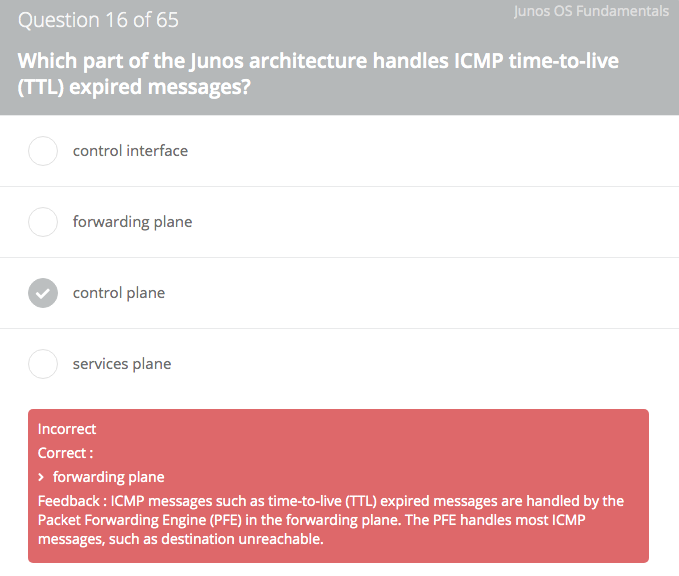
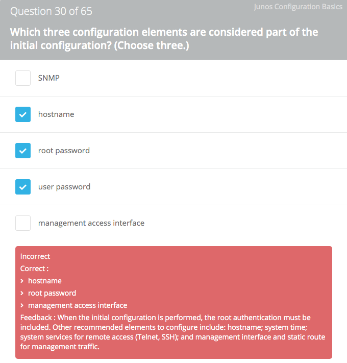
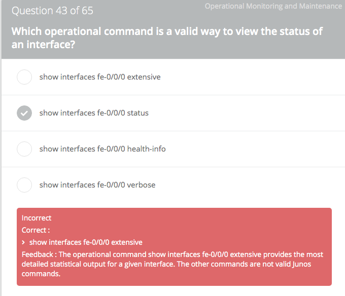

##

* https://wsr.pearsonvue.com/testtaker/registration/Dashboard/JUNIPERNETWORKS
* 7k:GKAa5b3d4tFk

## Practice Test

* https://cloud.contentraven.com/junosgenius/login (xleonzhao/)

* (only) Two modes exist in Junos: operational and configuration.
* Automatic word completion can be disabled in operational mode.
* Tab for both command and variable completion, Spacebar only for command completion.
* There are three Help facilities in Junos. The help topic command provides information on Junos features and configuration tasks.

* Q: What are two valid initial configuration methods supported on Junos devices? (Choose two)
    * A: The CLI is the preferred way to configure a Junos device. J-Web is a GUI-based configuration interface that allows you to configure many of a device’s properties.
* Q: Which command correctly sets a Junos device’s date and time?
    * A: `user@host> set date 199708290900.00`
    Feedback : The `set date` command is an operational mode command that uses the yyyymmhhhh.ss format. After setting the date, you should set the time zone with the set timezone command in the configuration under [edit system] in the Junos hierarchy. You might also consider implementing Network Time Protocol (NTP).
* Q: Which two statements are true about login classes in the Junos OS? (Choose two.)
    * A: Within the Junos software, a login class allows for individual commands to be explicitly allowed or denied. Each login class is associated with one or more permissions flags. You can also set up local user template accounts when you need different types of templates. Each template can define a different set of permissions appropriate for the group of users who use that template.

* Q: What is the role of route preference?
    * A: Route preferences are used to select which route is installed in the forwarding table when the routing table contains the same route from multiple protocols. The route with the lowest preference value is active.
* Q: What is a characteristic of route preference?
    * A: The route with the lowest preference value is preferred. In the case of learning the same route, from the same protocol, from different sources, the route metric can help in determining the preferred route. Routes with lower total path metrics are preferred over those with higher path metrics.
* `show route protocol ospf` displays all OSPF routes.
* Q: Which statement is correct about a routing policy term?
    * A: A term acts like "if" and "then" statements. If the match condition in the term is true, then the specified action is taken. If it is false, it moves on to the next term within the current policy. If no next term exists, it moves on to the next applied policy and evaluates that policy’s terms in sequential order.
* Q: What is a valid action for a firewall filter?
    * A: `then count`: A term in a firewall filter can be used to count packets passing through the filter.
    * other actions like `discard`, `accept`, `reject <message type>`, etc.
* You got 44 of 65 correct
