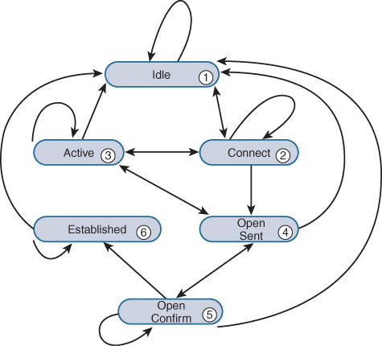

-   <http://www.ietf.org/rfc/rfc1771.txt>
-   <http://www.bgp4.as/>
-   <http://www.networksorcery.com/enp/protocol/bgp.htm>

### BGP finite state diagram



## BGP Message Header

           0                   1                   2                   3
           0 1 2 3 4 5 6 7 8 9 0 1 2 3 4 5 6 7 8 9 0 1 2 3 4 5 6 7 8 9 0 1
          +-+-+-+-+-+-+-+-+-+-+-+-+-+-+-+-+-+-+-+-+-+-+-+-+-+-+-+-+-+-+-+-+
          |                                                               |
          +                                                               +
          |                                                               |
          +                                                               +
          |                           Marker                              |
          +                                                               +
          |                                                               |
          +-+-+-+-+-+-+-+-+-+-+-+-+-+-+-+-+-+-+-+-+-+-+-+-+-+-+-+-+-+-+-+-+
          |          Length               |      Type     |
          +-+-+-+-+-+-+-+-+-+-+-+-+-+-+-+-+-+-+-+-+-+-+-+-+

-   Mark is used for authentication
-   Type
    -   1 - OPEN
    -   2 - UPDATE
    -   3 - NOTIFICATION
    -   4 - KEEPALIVE

## BGP OPEN message format

           0                   1                   2                   3
           0 1 2 3 4 5 6 7 8 9 0 1 2 3 4 5 6 7 8 9 0 1 2 3 4 5 6 7 8 9 0 1
           +-+-+-+-+-+-+-+-+
           |    Version    |
           +-+-+-+-+-+-+-+-+-+-+-+-+-+-+-+-+
           |     My Autonomous System      |
           +-+-+-+-+-+-+-+-+-+-+-+-+-+-+-+-+
           |           Hold Time           |
           +-+-+-+-+-+-+-+-+-+-+-+-+-+-+-+-+-+-+-+-+-+-+-+-+-+-+-+-+-+-+-+-+
           |                         BGP Identifier                        |
           +-+-+-+-+-+-+-+-+-+-+-+-+-+-+-+-+-+-+-+-+-+-+-+-+-+-+-+-+-+-+-+-+
           | Opt Parm Len  |
           +-+-+-+-+-+-+-+-+-+-+-+-+-+-+-+-+-+-+-+-+-+-+-+-+-+-+-+-+-+-+-+-+
           |                                                               |
           |                       Optional Parameters                     |
           |                                                               |
           +-+-+-+-+-+-+-+-+-+-+-+-+-+-+-+-+-+-+-+-+-+-+-+-+-+-+-+-+-+-+-+-+

    Parameters:

              0                   1
              0 1 2 3 4 5 6 7 8 9 0 1 2 3 4 5
             +-+-+-+-+-+-+-+-+-+-+-+-+-+-+-+-+-+-+-+-...
             |  Parm. Type   | Parm. Length  |  Parameter Value (variable)
             +-+-+-+-+-+-+-+-+-+-+-+-+-+-+-+-+-+-+-+-...

**Hold Time**: The hold-time value is advertised in open packets and indicates to the peer the length of time that it should consider the sender valid. If the peer does not receive a keepalive, update, or notification message within the specified hold time, the BGP connection to the peer is closed and routers through that peer become unavailable.

* The hold time is three times the interval at which keepalive messages are sent.

* The default hold time is 90 seconds.

## BGP Update message format

          +-----------------------------------------------------+
          |   Unfeasible Routes Length (2 octets)               |
          +-----------------------------------------------------+
          |   Withdrawn Routes (variable)                       |
          +-----------------------------------------------------+
          |   Total Path Attribute Length (2 octets)            |
          +-----------------------------------------------------+
          |   Path Attributes (variable)                       |
          +-----------------------------------------------------+
          |   Network Layer Reachability Information (variable) |
          +-----------------------------------------------------+

### BGP Path Attributes

-   Each path attribute is a triple (Type, Length, Value) or TLV.
-   Type is 2 octets. First octet is flag, second is code. Flag contains 8 bits, first 4 bits are:
```
                0                   1
                0 1 2 3 4 5 6 7 8 9 0 1 2 3 4 5
               +-+-+-+-+-+-+-+-+-+-+-+-+-+-+-+-+
               |  Attr. Flags  |Attr. Type Code|
               +-+-+-+-+-+-+-+-+-+-+-+-+-+-+-+-+

         The high-order bit (bit 0) of the Attribute Flags octet is the
         Optional bit.  It defines whether the attribute is optional (if
         set to 1) or well-known (if set to 0).

         The second high-order bit (bit 1) of the Attribute Flags octet
         is the Transitive bit.  It defines whether an optional
         attribute is transitive (if set to 1) or non-transitive (if set
         to 0).  For well-known attributes, the Transitive bit must be
         set to 1.
  ```  

* Path attributes fall into four separate categories:

 1. Well-known mandatory.
 2. Well-known discretionary.
 3. Optional transitive.
 4. Optional non-transitive.

* Well-known attributes must be recognized by all BGP implementations. Some of these attributes are mandatory and must be included in every UPDATE message. Others are discretionary and may or may not be sent in a particular UPDATE message.
  * well-known attribute are always transitive.
* if a router doesn't understand a transitive attribute, it should forward the attribute without touching it. But if a router understands, it can change it, like community attribute.
-   Paritial bit: 0: each router along the path recognized this attribute; 1: at least one router not.
-   Extended length bit: 0: L in TLV is 1 octet; 1: L is 2 octets.

| Attribute Name                  | Attribute Code | Attribute Type           |
| ------------------------------- | -------------- | ------------------------ |
| **Origin**                      | 1              | Well-known mandatory     |
| **AS Path**                     | 2              | Well-known mandatory     |
| **Next Hop**                    | 3              | Well-known mandatory     |
| **Multiple Exit Discriminator** | 4              | Optional nontransitive   |
| **Local Preference**            | 5              | Well-known discretionary |
| Atomic Aggregate                | 6              | Well-known discretionary |
| Aggregator                      | 7              | Optional transitive      |
| Community                       | 8              | Optional transitive      |
| Originator ID                   | 9              | Optional nontransitive   |
| Cluster List                    | 10             | Optional nontransitive   |
| Multiprotocol Reachable NLRI    | 14             | Optional nontransitive   |
| Multiprotocol Unreachable NLRI  | 15             | Optional nontransitive   |
| Extended Community              | 16             | Optional transitive      |

-   fields important to forwarding plane: *next-hop*.
-   fields affecting path selection process: **Local Preference > AS path > Origin > MED**.

#### Origin

-   Information on where the routes is learned, via IGP, or EGP, or don't know.
-   On path selection: IGP &gt; EGP &gt; incomplete.
-   V=
    -   0: IGP
    -   1: EGP
    -   2: incomplete

#### AS Path

-   V=(subTLVs). subTLV is called segment:
    -   (1 octet) T = 1: AS set; 2: AS sequence.
    -   (1 octet) L = total length of this segment.
    -   (variable) V=a list of ASs

#### Next Hop

-   BGP next hop or protocol next hop. This is changed when enter/exit an AS.
-   V=
    -   (4 octets): next hop IP address

#### Multiple Exit Discriminator

-   non-transitive. Only used when two ASes have multiple links between them and sending AS is trying to influence receiving AS on which link to use for data traffic.
-   will be propagated to iBGP peers
-   V=
    -   (4 octets): lower the value is, better.

#### Local Preference

-   used to set the preferred exit point out of the AS for a particular route.
-   never advertised to an EBGP peer.
-   default value is 100.
-   V=
    -   (4 octets): higher, better. (This is the only step in the
        algorithm that prefers a higher value over a lower value.)

#### Atomic Aggregate

-   Notify other routers that a less-specific route was selected over a more-specific route. Thus it implies data traffic may not follow the AS path in this advertisement.
    -   for example, if an AS receives a /16 and /24 from two different ASes, but selected /16 to advertise, then this attribute should be attached.
-   In addition, some attributes associated with more-specifics are not included in this advertisement.
-   no V.

#### Aggregator

-   JUNOS assigns this attribute to a route when a policy advertises an aggregated route into BGP.
-   V=
    -   (2-octets) AS number
    -   (4-octets) Router ID

#### Community

-   to group a set of routes by tagging them with same community attribute
-   mostly used to implement administrative policies, ie, to accept/reject/change path attribute/etc based on communit value.
-   V=
    -   (2-octets) AS Number
    -   (2-octets) locally defined value
-   well-known communities: AS Number portion is 0xffff.
    -   No-Export=0xff01: Tell neighboring AS, but neighboring AS, hopefully, should not tell their neighboring ASes.
    -   No-Advertise=0xff02: Tell neighboring router, but neighboring router should not tell their neighboring routers.
    -   No-Export-subconfed=0xff03: When confederation is used. Tell neighboring sub-AS, but neighboring sub-AS should not propagate routes further.
    -   [An example](BGP/well-known-community-usage-example.md)

#### Originator ID

-   when route reflector this attribute is used to prevent routing loop.
-   includes the router ID which first announced the route into the network.
-   should be contained inside the local AS.
-   V=
    -   (4-octets) router ID of the router that announced the route to
        the first route reflector in the network.

#### Cluster List

-   when route reflector this attribute is used to prevent routing loop.
-   route reflector prepends its cluster ID when advertise a route.
-   should be contained inside the local AS.
-   V=
    -   (variable): list of cluster IDs.

#### Multiprotocol Reachable NLRI

-   to advertise routing knowledge other than ipv4 unicast routes
-   non-transitive: scopes the advertisement to two neighboring ASs.
-   V=
    -   (2-octets) Address Family Identifier. 1: ipv4; 2: ipv6; 196:
        l2vpn.
    -   (1-octet) Subsequent Address Family Identifier. 1: unicast; 2:
        multicast; 128: labeled VPN unicast.
    -   (1-octet) Length of Next-Hop Address.
    -   (variable) Network Address of Next Hop.
    -   (1-octet) Number of SNPAs advertised in next field.
    -   (varibale) Sub-Network Points of Attachment. advertised layer 2
        SNPAs. Each SNPA is encoded using 1-octet length followed by
        SNPA value.
    -   (variable) Network Layer Reachability Information. Each NLRI is
        represented by a 1-octet length field followed by a
        variable-length prefix field.

#### Multiprotocol Unreachable NLRI

-   to withdraw routing knowledge previously advertised using
    MP-Reach-NLRI.
-   V=
    -   (2-octets) Address Family Identifier. 1: ipv4; 2: ipv6; 196:
        l2vpn.
    -   (1-octet) Subsequent Address Family Identifier. 1: unicast; 2:
        multicast; 128: labeled VPN unicast.
    -   (variable) Withdrawal routes. Each route is represented by a
        1-octet length field followed by a variable-length prefix field.

#### Extended Community

-   V=
    -   (2-octets) Type.
        -   higher octet = 0: The administrator field is 2 octets (AS
            number) and the assigned number field is 4 octets.
        -   higher octet = 1: The administrator field is 4 octets (IPv4
            address) and the assigned number field is 2 octets.
    -   (2/4-octets) Administrator value. AS number or IP address.
    -   (4/2-octets) Assigned number.

BGP Path Selection
------------------

1.  Check next hop reachability.
2.  Local Preference. Highest wins.
3.  Length of the AS Path attribute. Shorter path length wins.
4.  Origin attribute. IGP > EGP > incomplete.
5.  MED. Lowest wins.
6.  Type of BGP peer. EBGP peers > IBGP peers. (hot potato routing)
7.  IGP metric cost to each BGP peer. Lowest IGP cost wins.
    1.  Examines both the inet.0 and the inet.3 routing tables for the
        address of the BGP Next Hop. Use the physical next hop(s)
        associated with the lowest [route/protocol
        preference](/JUNOS_Route_Selection#Default_Route_Preference_Values "wikilink").
        (often means MPLS wins.)
    2.  if protocol preference ties (when default preference values are
        modified), use inet.3.
    3.  if protocol preference ties within the same routing table, use
        the physical next hop(s) where the greater number of equal cost
        paths exist.
8.  Cluster List. Shorter list wins.
9.  Router ID. Lower one wins.
10. Peer ID (in case multiple BGP sessions between two routers so router
    ID will tie). Lower peer ID (interface address) wins.

-   if *multipath* configured, Router ID and Peer ID steps will be
    skipped, all eligible next hop(s), up to 16 next hops, will be used
    to forward traffic.

Configuration Options
---------------------

### Multihop BGP

-   By protocol restriction, EBGP session is setup between two directly connected routers. So by default, BGP is using interface address. When interface went down, BGP will immediately tear the session. In the event of interface flap, BGP will flap. Using lo0 address for BGP session can prevent such flap.
-   when using lo0 for BGP session, we need multihop.

<!-- -->

    group external-peers {
      type external;
      multihop;
      peer-as 65020;
      local-address 192.168.40.1; <<< this is needed as well.
      neighbor 192.168.32.1;
    }

### BGP Load Balancing

-   JUNOS does per-prefix load balancing over a BGP session. If there are multiple equal cost path exists between two peers, prefixes are sprayed over all paths. It only balance prefixes, not data traffic.

### Graceful Restart

-   First, during BGP session establishment, both peers negotiate if they all support graceful restart. If yes, continue, stop otherwise.
-   When one peer restarts (tcp may reset), the other peer keeps forwarding traffic to the restarting peer. If the other peer detects restart event (eg via detection of tcp reset), it will mark all routes received from restarting peer as stale. (but it doesn't affect traffic forwarding.)
-   once the restarting peer returns to service, it informs the peer via an OPEN message

<!-- -->

    11:00:44.643978 In IP (tos 0xc0, ttl 64, id 37564, len 107)
      192.168.24.1.bgp > 192.168.36.1.3760: P 1:56(55) ack 56 win 16445
      <nop,nop,timestamp 50721382 50710953>: BGP, length: 55
        Open Message (1), length: 55
          Version 4, my AS 65010, Holdtime 90s, ID 192.168.24.1
          Optional parameters, length: 26
            Option Capabilities Advertisement (2), length: 6
              Multiprotocol Extensions, length: 4
              AFI IPv4 (1), SAFI Unicast (1)
            Option Capabilities Advertisement (2), length: 8
              Graceful Restart, length: 6
              Restart Flags: [R], Restart Time 120s
              AFI IPv4 (1), SAFI Unicast (1), Forwarding state preserved: yes

    from internet-draft draft-ietf-idr-restart-10.txt:
             Restart State (R)bit which can be used to avoid possible deadlock caused by
             waiting for the End-of-RIB marker when multiple BGP speakers
             peering with each other restart. When set (value 1), this bit
             indicates that the BGP speaker has restarted, and its peer
             SHOULD NOT wait for the End-of-RIB marker from the speaker
             before advertising routing information to the speaker.

             Restart Time should not larger than Hold timer.

             Unless allowed via configuration, the "Forwarding State" bit
             for an address family in the capability can be
             set only if the forwarding state has indeed been preserved for that
             address family during the restart.

-   restarting peer should defer route selection until End-of-RIB marker is received from its peer (unless the peer is also restarting). And the defer is bounded by a configurable time.
-   receiving peer should accept new OPEN message's TCP session and close previous TCP session. If forwarding state bit is not set, delete all routes previously learned from restarting peer.
-   receiving peer sent out accumulated updates during restarting followed by a End-of-RIB marker.
-   End-of-Marker is an empty update message.

<!-- -->

    [edit protocols bgp]
    user@Sangiovese# set graceful-restart ?
    restart-time        Restart time used when negotiating with a peer (1..600). Sent in OPEN message.
    stale-routes-time   Maximum time for which stale routes are kept (1..600). Local only. It is
                        the amount of time that the routes advertised by the restarting peer are used
                        for forwarding before being deleted.

### Authentication

-   Each TCP packets are protected by MD5 digest via a shared password.

### Avoiding Connection Collisions

-   use *passive* on a peer to force local peer to accept BGP connection only, not initiating.
-   use *allow* to specify an address range for possible peers.

### Establishing Prefix Limits

    > show configuration protocols bgp group external-peers
    type external;
    family inet {
      unicast {
        prefix-limit {
          maximum 10;
          teardown 80 idle-timeout 20;
        }
      }
    }

-   teardown: teardown the BGP session if maximum is exceeded.
-   teardown 80: once receiving prefixes exceed 80% of maximum, writing a syslog warning message.
-   idle-timeout 20: wait for 20 minutes before new BGP session can be initiated.

### Route Damping

-   JUNOS: only on EBGP routes.
-   change of figure of merit:
    -   1000 points are added when a route is withdrawn;
    -   1000 points are added when a route is readvertised;
    -   500 points are added when the path attributes of a route change;
    -   The figure of merit decreases exponentially based on a time variable.
-   max value: $$ceiling = reuse × exp(max-suppress ÷ half-life) × log(2)$$
    = 12326.76 by default.
-   configurable parameters:
    -   Suppression threshold: default=3000, range=[1 20,000]
    -   Reuse threshold: default=750, range=[1, 20,000]
    -   Half-life: default=15 minutes, range=[1, 45]. figure of metric decay exponentially to half in 15 minutes
    -   Maximum suppression time: default=60 minutes, range=[1, 720 minutes]

Modifying BGP Attributes
------------------------

### Local Preference

    neighbor 192.168.24.1 {
      local-preference 50;
    }

-   The important thing is to ensures that all routers in the network make consistent routing decisions. This can be done via "the Local Preference attribute is assigned to all received EBGP routes using an inbound routing policy."

### Multiple Exit Discriminator

`Path 1—via EBGP; AS Path of 65010; MED of 200`
`Path 2—via IBGP; AS Path of 65020; MED of 150; IGP cost of 5`
`Path 3—via IBGP; AS Path of 65010; MED of 100; IGP cost of 10`

-   MED and message arrival order. By default, JUNOS will collectively process them, i.e., in the deterministic way, while cisco will process them depending updates' arrival order, i.e., non-deterministic way.
-   For the above paths arrived in a short time, say, within 1 second.
    -   By default, JUNOS will compare path 1 and path 3 since they are from same neighboring AS (in this way MED makes more sense), then path 2. Final choice is path-2.
    -   cisco will do path-3, path-2, path-1 in sequence, which will give final result is path-1. *cisco-non-deterministic* knob will turn JUNOS to follow cisco.
    -   *always-compare-med* knob will compare MED from all neighboring ASs, not necessarily same AS, which will give final result as path-3.

<!-- -->

-   JUNOS allows to config MED on an individual peer, peer group, or all peers.

|                        |                 |
| ---------------------- | ------------- |
| metric-out 10          | all routes to this neighbor will with MED=10    |
| metric-out igp         | MED=IGP cost to the IBGP peer who advertised the route. MED value changes when IGP cost changes. |
| metric-out minimum-igp | MED=lowest IGP cost seen, only goes down. |
| metric-out igp 5       | MED=IGP+5  |

-   Policy can make finer granularity to prefix level

<!-- -->

    from {
      route-filter 172.20.0.0/16 orlonger;
    }
    then {
      metric igp;
    }

- [MED and IGP metric causing route oscillation](http://www.ietf.org/rfc/rfc3345.txt)

### AS Path

#### remove-private

    [edit protocols bgp group external-peers]
    remove-private;

-   should this be default whe you have a customer using private ASN?
-   this is not affecting private ASN in the middle of AS path.

#### local-as

-   When migrating one ASN to another, need peers also change their config. If some peer still use ur old ASN, "local-as" is to fool them.

<!-- -->

    [edit protocols bgp]
    user@Chardonnay# show group external-peers
    type external;
    peer-as 4444;
    local-as 1111 [private]; <<< private will remove 1111 when advertising to other peers.
    neighbor 10.222.44.1;

#### as-override

    [edit protocols bgp]
    user@Merlot# show group external-peers
    type external;
    peer-as 65010;
    as-override;
    neighbor 10.222.3.1;

-   using its own ASN to replace peer's ASN.
-   used when an AS is partitioned into two seperated parts and connected via another AS. In this case, two parts cannot receive routes from each other due to two parts use same ASN and AS path loop detection will see a loop.

#### loop

    user@Shiraz# show routing-options
    autonomous-system 65010 loops 2;

-   allow one ASN loop twice in an AS path.
-   used in same situation as "as-override"

#### prepend its own ASN

    from protocol aggregate;
      then {
      as-path-prepend "64888 64888";
      accept;
    }

-   this will add 3 64888 into the AS path.

#### prepend other's ASN

-   customer would like its ISP to NOT use a particular external AS for major traffic.

<!-- -->

    Before: the particular external AS saw this:
    * 172.16.1.0/24 B 170 100 >10.222.3.2 65010 64888 I

    ISP did what its customer asked:
    from as-path AS64888;
      then {
        as-path-expand last-as count 3;
      }
    }

    After: the particular external AS saw this:
    * 172.16.1.0/24 Self 64888 64888 64888 64888 I

### Origin

-   why someone need to do this? to affect route selection process, I guess?

<!-- -->

    from protocol static;
      then {
      origin egp;
      accept;
    }

IBGP Scaling Methods
--------------------

-   IBGP routers have to be full meshed. Why? To prevent routing loops.
    -   BGP is using AS path to detect loop. However, inside an AS, router A sent a route to B, B sent to C, C sent back to A. Should A use this route? A has no idea because AS path has not been changed yet. And there is no any other information helping A to detect loops.
    -   Therefore, it is a rule that an IBGP router cannot advertise a IBGP-learned route.
    -   Therefore, IBGP has to be fully meshed to make sure a route will be heard by all IBGP routers.
-   It causes scabalibility issue since the number of IBGP sessions grow very fast, O(n^2) where n is number of IBGP routers.

### Route Reflection

-   Route Reflector can advertise an IBGP-learned routes to another IBGP peer.
-   Topology considerations
    -   RRs have to be fully meshed.
    -   RR client can connect to other RR clients, but not necessary.
    -   RR client is better to reside in one cluster only (for clarity).
-   Configurations
    -   RR is configured with *cluster x.x.x.x* (cluster ID) inside a group. All neighbors inside this group will be its client.
    -   RR client doesn't need any conf changes.
-   Protocol changes. Two new BGP attributes are used for loop detection.
    -   Cluster List: a list of cluster ID is in BGP updates, which acts very similar to AS path, loop detection, prepending.
    -   Originator ID: the first router ID who injects the routes of interest. Second check against routing loops.

#### Operational Theory

-   RR is still a regular BGP router which selects and only advertises its best route to clients and non-clients. This may cause sub-optimal path to its client (best for RR is not necessarily best for client/non-client, ).
-   For RR, if *its best route* is learned
    -   from EBGP, then forward to all IBGP peers, including clients and other RRs. The Cluster List and Originator attributes are added only to routes advertised to clients within the cluster.
    -   from IBGP client, then forward to all other clients and RRs. RR adds Originator if doesn't have one yet, and a modifies Cluster List. Also, forward to all EBGP peers without Originator and Cluster list.
    -   from another RR, then forward to all clients and EBGP peers only. Originator should already be present and Cluster List will be prepended.
    -   *LZ: if learned first-hand, tell everybody; if not, tell clients only.*
-   RR will not change other path attributes by default.
-   **Route Reflectors and Loop Prevention:**
    -   The following rules are used to detect and avoid routing loops caused by route reflection:
        - If a router received an iBGP route with the Originator-ID attribute set to its own router-id, the route is discarded.
        - If a route reflector receives a route with a cluster-list attribute containing its cluster-id, the route is discarded.

#### Hierarchical RR network

-   can be any number of levels, no limit.

<!-- -->

    user@Chablis> show route 172.16.1/24 detail
    inet.0: 23 destinations, 23 routes (23 active, 0 holddown, 0 hidden)
    172.16.1.0/24 (1 entry, 1 announced)
      *BGP Preference: 170/-101
           Source: 192.168.56.1
           Next hop: 10.222.60.2 via fe-0/0/0.0, selected
           Protocol next hop: 192.168.36.1 Indirect next hop: 84cfbd0 57
           State: <Active Int Ext>
           Local AS: 65010 Peer AS: 65010
           Age: 12:24:08 Metric: 0 Metric2: 30
           Task: BGP_65010.192.168.56.1+179
           Announcement bits (2): 0-KRT 4-Resolve inet.0
           AS path: 64999 I (Originator) Cluster list: 1.1.1.1 3.3.3.3 2.2.2.2
           AS path: Originator ID: 192.168.36.1
           Localpref: 100
           Router ID: 192.168.56.1

Where 2.2.2.2 is the originator's cluster, 3.3.3.3 is higher level cluster including RRs for 1.1.1.1 and 2.2.2.2. Chablis is a client in cluster 1.1.1.1.

#### Redundant RR within a cluster

-   to avoid RR be single point of failure.
-   Cluster List is the one to prevent loops.

### Confederations

-   Large AS is splitted into small sub-ASs. Between sub-ASs, Confederation BGP is running.
-   CBGP is different from EBGP is
    -   CBGP doesn't modify any path attributes, nexthop, local-pref, etc, to make routing decision consistent.
    -   CBGP adds *AS Conferderation Sequence*, segment type 3, or *AS Confederation Set*, segement type 4, into AS path,
-   CBGP doesn't count confederation sequence/set into path length.
-   *remove-private-as* knob is not working for confederation, it may cause adverse effect.
-   each router is configured with sub-AS number and global ASN and list of all sub-ASN.

`user@Merlot> show configuration routing-options`
`autonomous-system 64777;`
`confederation 1111 members [ 64555 64777 ];`

Using Multiprotocol BGP
-----------------------

-   A very common application of MBGP is two IBGP peers in an AS supporting transit service, Layer 3 VPNs, and Layer 2 VPNs.
-   Capability negotiation is kicked in at session establishing stage. Capability is a new option (option type=2) in OPEN message. Capacity option includes a type (1-octet, which is set to constant 1), and length (1-octet, which is set to constant 4), and the following.

`0       7      15      23      31`
`+-------+-------+-------+-------+`
`|      AFI      | Res.  | SAFI  |`
`+-------+-------+-------+-------+`

-   AFI: Address Family Identifier
    -   1—IPv4
    -   2—IPv6
    -   196—Layer 2 VPN
-   SAFI: Subsequent Address Family Identifier
    -   1—Unicast
    -   2—Multicast
    -   4—Labeled unicast
    -   128—Labeled VPN unicast
    -   129—Labeled VPN multicast

### Internet Protocol Version 4 (AFI=1)

#### IPv4 multicast routes (SAFI=2)

-   MBGP multicast routes are used to perform reverse path forwarding (RPF) checks for received multicast data streams. Network operators sometimes need route multicast traffic via a different forwarding path from unicast traffic, which makes traditional inet.0 is not a good choice for RPF check.

`protocol bgp family inet {`
`  multicast`
`}`

#### IPv4 labeled unicast (SAFI=4)

-   The labeled VPN unicast routes are actually IPv4 NLRI with extended communities and MPLS labels attached to associate them with a specific LSP.

`protocol bgp family inet {`
`  labeled-unicast;`
`}`

#### IPv4 labeled VPN unicast (SAFI=128)

-   For L3VPN when an ISP is actively participating in customer's routing. ISP is responsible to ship customer's (public or private) IP address space from one side of ISP (CE1-&gt;PE1) to another side (PE2-&gt;CE2).
-   The routes advertised in this way will be put in bgp.l3vpn.0.

`protocol bgp family inet-vpn {`
`  unicast;`
`}`

#### IPv4 labeled VPN multicast (SAFI=129)

-   IPv4 multicast relates to IPv4 unicast &lt;-similar to-&gt; IPv4 labeled multicast vs IPv4 labeled unicast. Again, the purpose is to get a different routing table for RPF checks.
-   The routes advertised in this way will be put in bgp.l3vpn.2.

`protocol bgp family inet-vpn {`
`  multicast;`
`}`

### Layer 2 Virtual Private Networks (AFI=129)

-   ISP is not participating customer's routing anymore. Instead, ISP only ship layer 2 logical circuit information and MPLS label. Customer will handle routing themselves.

`family inet {`
`  l2vpn;`
`}`

Summary
-------

In this chapter, we examined the operation of the Border Gateway Protocol within the JUNOS software. We first examined the BGP Update message used to advertise and withdraw routes from a peer. We followed this with a look at each of the defined BGP attributes used in today’s network environments. The format of each attribute was displayed and an explanation was supplied for each defined variable. The route attributes are instrumental in the selection of an active BGP route, so our discussion moved to the operation of the route selection algorithm. We talked about each step of the process in depth and then saw some CLI commands available to verify the operation of the selection process.

We concluded the chapter with an exploration of some BGP configuration options available on a Juniper Networks router. We began with methods of supplying multiple physical next hops to a single BGP route using either multipath or multihop. This led us into a short examination of how BGP load-balances multiple routes received from an IBGP peer. The next configuration option discussed was graceful restart and its effect on the forwarding of traffic as well as the stability of the network. Peer options were examined next, including MD5 authentication as well as the passive and allow commands. After looking at methods for limiting the number of prefixes received from a peer, we saw the effectiveness of BGP route damping. This included a look at the default damping parameters and the selective alteration of its operation using a routing policy.

In this chapter, we saw the various methods available within the JUNOS software for modifying the BGP attributes. The Origin attribute was altered using a routing policy as routes were advertised to a peer. We then saw how both configuration options and routing policies affected the AS Path attribute. The AS Path was prepended using our local as well as our customer’s AS value. The attribute also had values removed or modified using configuration options such as remove-private and as-override. We then discussed the Multiple Exit Discriminator and how to set the MED value using a policy and a configuration knob. We also saw two different methods for associating the advertised MED to the internal IGP metric in our AS. Finally, methods for altering how the JUNOS software evaluates and uses the MED attribute were discussed.

We concluded our attribute discussion by using a routing policy and a configuration option to change the Local Preference attribute before advertising a route to a peer. We then explored two different methods for scaling a large IBGP full mesh of routers. The first option was route reflection, which allows an IBGP-learned route to be readvertised to another IBGP peer. The router responsible for this was the route reflector within a cluster. The second method of scaling an IBGP network is confederations. A BGP confederation network breaks the AS into smaller member AS networks, or sub-AS networks. Within each sub-AS an IBGP full mesh was still required, but each sub-AS was connected using an EBGP-like connection known as confederation BGP.

We concluded the chapter with a discussion on Multiprotocol BGP (MBGP). We examined some reasons for using MBGP inside a local AS or between multiple ASs. The configuration and verification of each unique AFI/SAFI set was explored.

Check List
----------

-   describe common path attributes
-   **steps of route selection process**
-   CLI command to verify the operation of route selection algorithm
    (*show route detail* and *inactive reason*)
-   use multiple physical nexthops to a single BGP route (multipath, multihop for lo0)
-   operation of graceful restart
-   config route damping (*damping* at neighbor/group/global level)
-   config to modify AS path attribute
-   MED in path selection
-   two method to alter Local Pref
-   operation of route reflector network
-   operation of confederation network
-   config multiprotocol BGP
