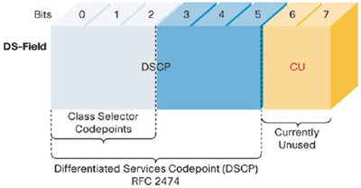

Class of Service Overview
-------------------------

-   Packets in, router **classify** (and mark if needed) the packet
    based on DSCP or EXP bits or firewall filter, put packets into
    proper queue, **scheduler** will take care of which packet will be
    served first per *Forwarding Class* and/or which packet will be
    dropped per *Loss Priority*.
-   every router along the path has to be touched to support CoS.
-   there are two things "mechanical": 1) DSCP/EXP bits, 2) 4 or 8
    queues and the corresponding scheduler to service those queues.
-   from configuration point of view, *classifier* configures how to
    mark DSCP/EXP bits, while *scheduler* configures the behavior of
    scheduler. *scheduler-map* associates *scheduler* to interfaces.

Terminology
-----------

* **Classification**: _Classification_ refers to the examination of an incoming packet. This function often associates the packet with a particular CoS servicing level.
  * **Behavior aggregate**: A *behavior aggregate (BA)* is a method of classification that operates on a packet as it enters the router. The packet header contents are examined, and this single field determines the CoS settings applied to the packet.
  * **Multi-field classifier**: A *multi-field (MF) classifier* is a second method for classifying traffic flows. Unlike a behavior aggregate, an MF classifier has the ability to examine multiple fields in the packet for applying CoS settings. Examples of some fields that an MF classifier may examine include the source and destination address of the packet as well as the source and destination port numbers of the packet.

**Queuing**: After a packet is sent to the outgoing interface on a router, it is queued for transmission on the physical media.

**Scheduling**: An individual router interface may have multiple queues assigned to store packets. The router then decides which queue to service based on a particular method of scheduling.

**Rewrite Rules**: A rewrite rule sets the appropriate CoS bits in the outgoing packet. This allows the next downstream router to classify the packet into the appropriate service group.

Classifying the Packets
-----------------------

### IPv4

-   By default, JUNOS uses three MSB of *TOS* field in IP header for
    CoS.
-   JUNOS also support DSCP (6 bits).

|                                                                                                                                                   |                                                                                            |                                                                                        |                                                                                  |     |     |     |     |     |     |     |     |     |     |     |     |     |     |     |     |     |     |     |     |     |     |     |     |     |     |     |     |
| ------------------------------------------------------------------------------------------------------------------------------------------------- | ------------------------------------------------------------------------------------------ | -------------------------------------------------------------------------------------- | -------------------------------------------------------------------------------- | --- | --- | --- | --- | --- | --- | --- | --- | --- | --- | --- | --- | --- | --- | --- | --- | --- | --- | --- | --- | --- | --- | --- | --- | --- | --- | --- | --- |
| 00                                                                                                                                                | 01                                                                                         | 02                                                                                     | 03                                                                               | 04  | 05  | 06  | 07  | 08  | 09  | 10  | 11  | 12  | 13  | 14  | 15  | 16  | 17  | 18  | 19  | 20  | 21  | 22  | 23  | 24  | 25  | 26  | 27  | 28  | 29  | 30  | 31  |
| [Version](http://www.networksorcery.com/enp/protocol/ip.htm#Version)                                                                              | [IHL](http://www.networksorcery.com/enp/protocol/ip.htm#IHL,%20Internet%20Header%20Length) | [TOS](http://www.networksorcery.com/enp/protocol/ip.htm#TOS,%20Type%20of%20Service)    | [Total length](http://www.networksorcery.com/enp/protocol/ip.htm#Total%20Length) |     |     |     |     |     |     |     |     |     |     |     |     |     |     |     |     |     |     |     |     |     |     |     |     |     |     |     |     |
| [Identification](http://www.networksorcery.com/enp/protocol/ip.htm#Identification)                                                                | [Flags](http://www.networksorcery.com/enp/protocol/ip.htm#Flags)                           | [Fragment offset](http://www.networksorcery.com/enp/protocol/ip.htm#Fragment%20Offset) |                                                                                  |     |     |     |     |     |     |     |     |     |     |     |     |     |     |     |     |     |     |     |     |     |     |     |     |     |     |     |     |
| [TTL](http://www.networksorcery.com/enp/protocol/ip.htm#TTL,%20Time%20to%20Live)                                                                  | [Protocol](http://www.networksorcery.com/enp/protocol/ip.htm#Protocol)                     | [Header checksum](http://www.networksorcery.com/enp/protocol/ip.htm#Header%20checksum) |                                                                                  |     |     |     |     |     |     |     |     |     |     |     |     |     |     |     |     |     |     |     |     |     |     |     |     |     |     |     |     |
| [Source IP address](http://www.networksorcery.com/enp/protocol/ip.htm#Source%20IP%20address)                                                      |                                                                                            |                                                                                        |                                                                                  |     |     |     |     |     |     |     |     |     |     |     |     |     |     |     |     |     |     |     |     |     |     |     |     |     |     |     |     |
| [Destination IP address](http://www.networksorcery.com/enp/protocol/ip.htm#Destination%20IP%20address)                                            |                                                                                            |                                                                                        |                                                                                  |     |     |     |     |     |     |     |     |     |     |     |     |     |     |     |     |     |     |     |     |     |     |     |     |     |     |     |     |
| [Options](http://www.networksorcery.com/enp/protocol/ip.htm#Options) and [padding](http://www.networksorcery.com/enp/protocol/ip.htm#Padding) ::: |                                                                                            |                                                                                        |                                                                                  |     |     |     |     |     |     |     |     |     |     |     |     |     |     |     |     |     |     |     |     |     |     |     |     |     |     |     |     |

* ToS byte *before* DiffServ

* ToS byte *after* DiffServ

### MPLS

-   3 EXP bits.

JUNOS Software Implementation
-----------------------------

### Packet Flow

1.  When a packet enters an M-series Juniper Networks router, the
    Physical Interface Connector (PIC) receiving the packet retrieves it
    from the network and verifies that the link-layer information is
    valid.
2.  The packet is then passed to the Flexible PIC Concentrator (FPC),
    where the data-link and network layer information is verified. In
    addition, the FPC is responsible for segmenting the packet into
    64-byte J-cells. (**CoS classified here once**)
3.  These cells are then written into packet storage memory while a
    notification cell is sent to the route lookup engine.
4.  The destination address listed in the notification cell is located
    in the forwarding table, and the next hop of the packet is written
    into the result cell. (**CoS classified here twice by firewall
    filter**)
5.  This result cell is queued on the appropriate outbound FPC until the
    outgoing interface is ready to transmit the packet. The FPC then
    reads the J-cells out of memory, reforms the original packet, and
    sends the packet to the outgoing PIC, where it is transmitted back
    into the network. (**Queuing and Scheduling occur here**)

### CoS Association

#### Incoming I/O Manager ASIC

During the processing of the packet by this ASIC (Bi chip), the
information in the packet’s header is examined by a behavior aggregate
classifier. This classification action associates the packet with a
particular forwarding class. In addition, the value of the packet’s loss
priority bit is set by this classifier. Both the forwarding class and
loss priority information are placed into the notification cell, which
is then transmitted to the Internet Processor ASIC.

#### Internet Processor ASIC

While the packet is being processed by the Internet Processor ASIC (C
chip), it may also be evaluated by a firewall filter, which is
configured on either the incoming or outgoing interface. This filter can
perform the functions of an MF classifier by matching on multiple
elements within the packet and *overwriting* the forwarding class and/or
loss priority settings within the notification cell. Once the route
lookup and filter evaluations are complete, the notification cell, now
called the result cell, is passed to the I/O manager ASIC on the FPC
associated with the outgoing interface.

#### Outgoing I/O Manager ASIC

When the result cell is received by the I/O Manager ASIC (Bo chip), it
is placed into a queue to await transmission on the physical media. The
specific queue used by the ASIC is determined by the forwarding class
associated with the data packet. The configuration of the queue itself
helps determine the service the packet receives while in this queued
state. This functionality guarantees that certain packets deemed
important by the network administrator be serviced and transmitted
before other less important packets. In addition, the queue settings and
the packet’s loss priority setting determine which packets may be
dropped from the network during periods of congestion and contention.

In addition to queuing the packet, the outgoing I/O manager ASIC is
responsible for ensuring that CoS bits in the packet’s header are
correctly set before it is transmitted. This rewrite function helps the
next downstream router perform its CoS function in the network.

### CoS Configuration

#### Define Code Points

-   What does those DSCP/EXP bits mean to us?
-   mapping bits value to a name.
-   Default values are:

<!-- -->

    user@Merlot>show class-of-service code-point-aliases inet-precedence
    Code point type: inet-precedence
      Alias    Bit pattern
      af11     001
      af21     010
      af31     011
      af41     100
      be       000
      cs6      110
      cs7      111
      ef       101
      nc1      110
      nc2      111

-   Configuration to change default alias name.

<!-- -->

    user@Merlot> show configuration class-of-service code-point-aliases
    inet-precedence {
      best-effort 000;
      gold 010;
      platinum 100;
      network-control 110;
    }

#### Forwarding Classes

-   The forwarding class is referenced in both a classifier and a
    rewrite rule. In addition, the forwarding classes are closely
    aligned with the operation and definitions of the router’s queues.
-   Map a queue to a name

<!-- -->

    user@Merlot> show configuration class-of-service forwarding-classes
    queue 0 best-effort;
    queue 1 gold;
    queue 2 platinum;
    queue 3 network-control;

#### Behavior Aggregate Classifier

-   BA classifier to bring code points and forwarding class together,
    i.e., mapping from each to the other.
-   The function of a behavior aggregate classifier is the examination
    of the CoS bits in the packet header and the assignment of that
    packet to a specific level of service. Within the confines of the
    JUNOS software, this means that the classifier should assign a
    forwarding class to the packet as well as set the packet’s loss
    priority value to high or low.
-   By default, the JUNOS software uses a classifier called
    *ipprec-compatability* on all of the router’s interfaces. This
    classifier will treat all code points as best effort except for
    110/111 which will be network-control traffic such as ISIS/BGP
    traffic.

<!-- -->

    user@Merlot> show class-of-service interface so-0/1/0
    ...
    Logical interface: so-0/1/0.0, Index: 67
      Object     Name                 Type Index
      Rewrite    exp-default          exp  2
      Classifier ipprec-compatibility ip   5

    user@Merlot> show class-of-service classifier type inet-precedence
    Classifier: ipprec-default, Code point type: inet-precedence, Index: 4
    ...
    Classifier: ipprec-compatibility, Code point type: inet-precedence, Index: 5
      Code point    Forwarding class    Loss priority
      000           best-effort         low
      001           best-effort         high
      010           best-effort         low
      011           best-effort         high
      100           best-effort         low
      101           best-effort         high
      110           network-control     low
      111           network-control     high

-   Configuration of forwarding class which includes two things: 1)
    which code point to which queue and 2) loss priority.

<!-- -->

    # mapping a queue to a name, aka, forwarding class.
    xzhao@NY325-BB-RTR2> ...s-of-service forwarding-classes
    queue 0 DATA;
    queue 1 REAL-TIME;
    queue 2 EXPEDITED-FORWARDING;
    queue 3 NETWORK-CONTROL;

    # mapping code points to queue name.
    xzhao@NY325-BB-RTR2> show configuration class-of-service classifiers
    ...
    inet-precedence CLASSIFY-IP-TRAFFIC {
        forwarding-class NETWORK-CONTROL {
            loss-priority low code-points 110;
            loss-priority high code-points 111;
        }
        forwarding-class DATA {
            loss-priority high code-points [ 000 001 010 011 100 101 ];
        }
    }

    xzhao@NY325-BB-RTR2> ...lassifier name CLASSIFY-IP-TRAFFIC
    Classifier: CLASSIFY-IP-TRAFFIC, Code point type: inet-precedence, Index: 2824
      Code point         Forwarding class                    Loss priority
      000                DATA                                high
      001                DATA                                high
      010                DATA                                high
      011                DATA                                high
      100                DATA                                high
      101                DATA                                high
      110                NETWORK-CONTROL                     low
      111                NETWORK-CONTROL                     high

-   Apply classifier to an interface

<!-- -->

    [edit class-of-service interfaces so-0/1/0 unit 0]
    user@Merlot# set classifiers inet-precedence CLASSIFY-IP-TRAFFIC

#### Multi-Field Classifiers

-   MF classifier gives you the ability to use any filter match criteria
    to locate packets that require further classification. Once the
    packets are located, you alter the forwarding class or loss priority
    settings by using the action statements of then forwarding-class or
    then loss-priority, respectively.
-   Assuming the network administrators would like to ensure that all
    packets destined for the 10.10.10.0 /24 network are placed into the
    platinum forwarding class. This assignment should occur regardless
    of the received bit values in the packet.

<!-- -->

    user@Merlot> show configuration firewall
    filter set-FC-to-gold {
      term match-a-single-route {
        from {
          destination-address {
            10.10.10.0/24;
          }
        }
        then {
          forwarding-class platinum;
          accept;
        }
      }
      term accept-all {
        then accept;
      }
    }

#### Drop Profile

-   A drop profile is the most basic building block of implementing a
    random early discard (RED) configuration. Simply put, the drop
    profile defines parameters that allow the packet to be dropped from
    the network. The two main portions of the drop profile are the queue
    fullness and the drop probability.

    <<< segmented
    user@Chardonnay> show configuration class-of-service drop-profiles
    s-drop {
      fill-level 25 drop-probability 25;
      fill-level 50 drop-probability 50;
      fill-level 75 drop-probability 75;
      fill-level 95 drop-probability 100;
    }

    <<< interpolated
    user@Chianti> show configuration class-of-service drop-profiles
    i-drop {
      interpolate {
        fill-level [ 50 75 ];
        drop-probability [ 25 50 ];
      }
    }

-   When a packet reaches the head of the queue, a random number between
    0 and 100 percent is calculated by the router. This random number is
    plotted against the drop profile using the current queue fullness of
    that particular queue. When the random number falls above the graph
    line, the packet is transmitted onto the physical media, but when
    the number falls below the line, it is dropped from the network.
-   default drop profile is segmented graph with *fill-level 0 drop 0*
    and *fill-level 100 drop 100*.
-   Apply the drop profile:

<!-- -->

    user@Merlot> show configuration class-of-service schedulers
    best-effort {
      drop-profile-map loss-priority low protocol any drop-profile s-drop;
      drop-profile-map loss-priority high protocol any drop-profile i-drop;
    }

#### Scheduler

The JUNOS software uses schedulers to define the properties of an
individual queue. These include the amount of interface bandwidth
assigned to the queue, the size of the memory buffer allocated for
storing result cells, the priority of the queue, and the drop profiles
associated with the queue.

-   Each queue is allocated some portion of the bandwidth of the
    outgoing interface. The knob **transmit-rate** provides you the
    control to guarantee that each queue receives the amount of
    bandwidth appropriate to its level of service.
    -   The transmit-rate controls how many packets are allowed to be
        transmitted, which can be translated into \# of result cells are
        allowed in queue. transmit-rate / average-packet-size. For
        example, 1M transmit-rate, 500b average packet size, means, 2k
        result cells.
    -   I remembered there is a formula Juniper uses to use
        transmit-rate for weighted-round-robin service of queue.
-   The second attribute we can assign to a scheduler is the amount of
    memory buffer allocated to store and queue the result cells. This is
    configured using the **buffer-size** command.
    -   One method (*buffer-size percent*) for setting the buffer size
        is defining a percentage of the total memory space allocated on
        the outgoing FPC.
    -   A second method (*buffer-size temporal*) involves setting a time
        value, expressed in microseconds, which represents the longest
        amount of time an individual packet should be queued.
        -   Setting larger values for the buffer-size means a greater
            possibility exists for delaying packets in the network. This
            may not be useful for sensitive traffic such as voice or
            video. By default, the buffer-size setting is equal to the
            transmit-rate. In fact, this type of configuration is
            recommended.
    -   The buffer-size controls the available space in queue. If it is
        larger than transmit-rate, that queue should never drop packets
        in theory.
-   The third scheduler attribute is the **priority** of the queue
    itself. This allows the JUNOS software to service certain
    high-priority queues before low-priority queues.

<!-- -->

    user@Merlot> show configuration class-of-service schedulers
    best-effort {
      transmit-rate remainder;
      buffer-size remainder;
      priority low;
      drop-profile-map loss-priority low protocol any drop-profile low-drop;
      drop-profile-map loss-priority high protocol any drop-profile high-drop;
    }
    network-control {
      transmit-rate 1m exact;
      buffer-size percent 5;
      priority high;
      drop-profile-map loss-priority low protocol any drop-profile low-drop;
      drop-profile-map loss-priority high protocol any drop-profile high-drop;
    }
    gold {
      transmit-rate percent 15;
      buffer-size percent 50;
      priority low;
      drop-profile-map loss-priority low protocol any drop-profile low-drop;
      drop-profile-map loss-priority high protocol any drop-profile high-drop;
    }
    platinum {
      transmit-rate percent 25;
      buffer-size temporal 200;
      priority high;
      drop-profile-map loss-priority low protocol any drop-profile low-drop;
      drop-profile-map loss-priority high protocol any drop-profile high-drop;
    }

#### scheduler-map

-   Associate scheduler with a forwarding class. Forwarding class is
    already assigned a queue number and the scheduler contains the
    parameters that queue should use.

<!-- -->

    user@Merlot> show configuration class-of-service scheduler-maps
    sample-cos-scheduler-map {
      forwarding-class best-effort scheduler best-effort;
      forwarding-class gold scheduler gold;
      forwarding-class platinum scheduler platinum;
      forwarding-class network-control scheduler network-control;
    }

-   Associate scheduler with an outgoing interface.

<!-- -->

    so-0/1/2 {
      scheduler-map sample-cos-scheduler-map;
    }

    user@Merlot> show class-of-service interface so-0/1/2
    Physical interface: so-0/1/2, Index: 131
      Scheduler map: sample-cos-scheduler-map, Index: 22802

#### Queue Servicing

-   Dropping packets:
    -   Drop-profile configuration turned on RED.
    -   RED drops packet from head of queue, not tail.
-   Order to serve the queue:
    -   *in profile*: when the transmitted amount is less than the
        allocated amount defined by *transmit-rate*, the queue is
        considered to be in profile.
    -   *out of profile*: a queue is out of profile when its transmitted
        amount is larger than its allocated amount.

1.  The router first locates all high-priority queues that are currently
    in profile. These queues are serviced first in a weighted
    round-robin fashion.
2.  The router then locates all low-priority queues that are currently
    in profile. These queues are also serviced using a weighted
    round-robin scheme.
3.  The router then locates all high-priority queues that are currently
    out of profile and that are not rate limited. The weighted
    round-robin algorithm is applied to these queues for servicing.
4.  The router finally locates all low-priority queues that are
    currently out of profile and are also not rate limited. These queues
    are serviced last in a weighted round-robin manner.

#### Rewrite Rules

-   Rewrite rules are applied after the data packet is reassembled by
    the I/O Manager ASIC (Bo/Nout) on the outgoing FPC and set the value
    of the CoS bits within the packet’s header.
-   The specific bit settings are determined by the packet’s forwarding
    class and loss priority setting.
-   In effect, it performs the opposite function of the behavior
    aggregate classifier used as the packet enters the router.

<!-- -->

    user@Merlot> show configuration class-of-service rewrite-rules
    inet-precedence sample-cos-rewrite-rule {
      forwarding-class best-effort {
        loss-priority high code-point best-effort;
      }
      forwarding-class gold {
        loss-priority high code-point gold;
      }
      forwarding-class platinum {
        loss-priority low code-point platinum;
      }
      forwarding-class network-control {
        loss-priority low code-point network-control;
      }
    }

    so-0/1/2 {
      scheduler-map sample-cos-scheduler-map;
      unit 0 {
        rewrite-rules {
          inet-precedence sample-cos-rewrite-rule;
        }
      }
    }

Check List
----------

-   Be able to describe how individual IP data packets can be examined
    by a router configured for CoS.
-   Be able to identify the queuing methods employed by a Juniper
    Networks router.
-   Be able to identify the use of a classifier within a router.
-   Be able to describe the use of a drop profile in a router.
-   Understand the components that are associated with a scheduler.
-   Understand the functionality of a rewrite rule.
