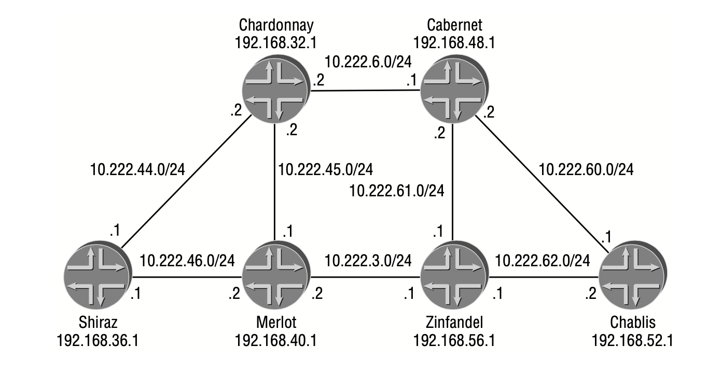

- [LDP Overview](#ldp-overview)
  - [LDP common header](#ldp-common-header)
  - [LDP message](#ldp-message)
- [Becoming LDP Neighbors](#becoming-ldp-neighbors)
- [Establishing LDP Sessions](#establishing-ldp-sessions)
- [Exchanging Information across a Session](#exchanging-information-across-a-session)
  - [Advertising Interface Addresses](#advertising-interface-addresses)
  - [Advertising Label Values](#advertising-label-values)
- [Maintain LDP session](#maintain-ldp-session)
- [Label Propagation Process](#label-propagation-process)
  - [Loop prevention](#loop-prevention)
  - [Special labels](#special-labels)

# LDP Overview

-   <http://www.networksorcery.com/enp/protocol/LabelDistributionProtocol.htm>
-   <http://www.ietf.org/rfc/rfc3036.txt>
-   A `Forwarding Equivalence Class (FEC)` represents a prefix that is mapped by an egress router to an LSP, more specifically, a flow of IP packets through an MPLS network where each packet in the flow is processed identically and forward across the same physical path.
-   Egress LDP router (edge router of a LDP domain) allocates a label for a FEC and advertises it to all its LDP peers. The peer will allocate a different label locally and re-advertise it to its own peers, and same process goes on and on until all LDP routers knows how to reach the FEC. (similar to BGP advertising process)
    -   A LDP LSP is a LDP path from a remote router to the egress LDP router of a FEC.
-   LDP follows IGP for route selection, when multiple labels for same FEC available.
    -   when using IGP for route selection, and there are multiple equal cost nexthops available in IGP, inet.3 can select any of those, independent of inet.0.
-   By default, LDP only advertises lo0 address as FEC initially. Eventually, every LDP router will have a LSP to reach any other LDP routers, which forms a full mesh among LDP routers.
-   **All lo0 addresses advertised through LDP will be placed in inet.3. Because BGP will consult inet.3 for protocol nexthop first**, then inet.0, the consequence is BGP will use labels instead of IP routing to forwarding traffic for BGP prefixes,
-   Additional FECs can be advertised through LDP through policies.
-   Gain from LDP: Edge routers run BGP among them but do not distribute external routes to the core. Instead, the recursive route lookup at the edge resolves to an LSP switched to the egress router. No external routes are necessary on the transit LDP routers.

## LDP common header

        0                   1                   2                   3
        0 1 2 3 4 5 6 7 8 9 0 1 2 3 4 5 6 7 8 9 0 1 2 3 4 5 6 7 8 9 0 1
       +-+-+-+-+-+-+-+-+-+-+-+-+-+-+-+-+-+-+-+-+-+-+-+-+-+-+-+-+-+-+-+-+
       |  Version                      |         PDU Length            |
       +-+-+-+-+-+-+-+-+-+-+-+-+-+-+-+-+-+-+-+-+-+-+-+-+-+-+-+-+-+-+-+-+
       |                         LDP Identifier                        |
       +                               +-+-+-+-+-+-+-+-+-+-+-+-+-+-+-+-+
       |                               |         LDP Message           |
       +-+-+-+-+-+-+-+-+-+-+-+-+-+-+-+-+-+-+-+-+-+-+-+-+-+-+-+-+-+-+-+-+

* `Verion`: 1
* `PDU length`: total PUD length (excluding version and PDU length field).
* `LDP Identifier`: first four octets are router ID, last two octets are label space. If per-router label allocation method is used, last two octets are 0.

## LDP message

-   A LDP message may include one or more TVLs. All LDP messages have the following format:

```
   0                   1                   2                   3
   0 1 2 3 4 5 6 7 8 9 0 1 2 3 4 5 6 7 8 9 0 1 2 3 4 5 6 7 8 9 0 1
  +-+-+-+-+-+-+-+-+-+-+-+-+-+-+-+-+-+-+-+-+-+-+-+-+-+-+-+-+-+-+-+-+
  |U|   Message Type              |      Message Length           |
  +-+-+-+-+-+-+-+-+-+-+-+-+-+-+-+-+-+-+-+-+-+-+-+-+-+-+-+-+-+-+-+-+
  |                     Message ID                                |
  +-+-+-+-+-+-+-+-+-+-+-+-+-+-+-+-+-+-+-+-+-+-+-+-+-+-+-+-+-+-+-+-+
  |                                                               |
  +                                                               +
  |                     Mandatory Parameters (TLVs)               |
  +                                                               +
  |                                                               |
  +-+-+-+-+-+-+-+-+-+-+-+-+-+-+-+-+-+-+-+-+-+-+-+-+-+-+-+-+-+-+-+-+
  |                                                               |
  +                                                               +
  |                     Optional Parameters (TLVs)                |
  +                                                               +
  |                                                               |
  +-+-+-+-+-+-+-+-+-+-+-+-+-+-+-+-+-+-+-+-+-+-+-+-+-+-+-+-+-+-+-+-+
```

* `U`： Unknown message bit:
  * U=0: a notification is returned to the message originator;
  * U=1: the unknown message is silently ignored.
* `Message ID`: uniquely identifying this message.

| Message ID   | Message Name         | Function                                                                                     |
|-----------------------|----------------------|----------------------------------------------------------------------------------------------|
| 0x0100                | Hello                | Discovery: announces and maintains LDP peer adjacency                                        |
| 0x0200                | Initialization       | Session setup: negotiates session parameters (version, keepalive interval, etc.)             |
| 0x0201                | KeepAlive            | Session maintenance: confirms the LDP session is still alive                                  |
| 0x0300                | Address              | Advertisement: advertises the set of IP addresses (FEC next-hops) associated with the LSR   |
| 0x0301                | Address Withdraw     | Advertisement: withdraws previously advertised IP addresses                                   |
| 0x0400                | Label Mapping        | Advertisement: distributes label bindings for a given FEC                                    |
| 0x0401                | Label Request        | Advertisement: requests a label binding for a specific FEC                                   |
| 0x0402                | Label Withdraw       | Advertisement: withdraws a previously advertised label binding                                |
| 0x0403                | Label Release        | Advertisement: acknowledges and triggers removal of a label binding                           |
| 0x0404                | Label Abort Request  | Advertisement: aborts a pending label request for a FEC                                      |
| 0x0001                | Notification         | Notification: signals errors or significant events to an LDP peer                            |
| 0x3E00–0x3EFF         | Vendor-Private       | Vendor-specific extension messages                                                            |
| 0x3F00–0x3FFF         | Experimental         | Experimental extension messages                                                               |

-   TLV

```
   0                   1                   2                   3
   0 1 2 3 4 5 6 7 8 9 0 1 2 3 4 5 6 7 8 9 0 1 2 3 4 5 6 7 8 9 0 1
  +-+-+-+-+-+-+-+-+-+-+-+-+-+-+-+-+-+-+-+-+-+-+-+-+-+-+-+-+-+-+-+-+
  |U|F|        Type               |            Length             |
  +-+-+-+-+-+-+-+-+-+-+-+-+-+-+-+-+-+-+-+-+-+-+-+-+-+-+-+-+-+-+-+-+
  |                                                               |
  |                             Value                             |
  ~                                                               ~
  |                                                               |
  |                               +-+-+-+-+-+-+-+-+-+-+-+-+-+-+-+-+
  |                               |
  +-+-+-+-+-+-+-+-+-+-+-+-+-+-+-+-+
```

* `U`: Unknown TLV. 1 bit:
  * U=0: A notification must be returned to the message originator and the
entire message must be ignored.
  * U=1: The unknown TLV is silently ignored and the rest of the message is
processed as if the unknown TLV did not exist.
* `F`: Forward unknown TLV. 1 bit: Valid only when the U bit is set and the LDP message containing the unknown TLV is to be forwarded.
  * F=0: The unknown TLV is not forwarded with the containing message.
  * F=1: The unknown TLV is forwarded with the containing message.

# Becoming LDP Neighbors

-   to enable LDP:

`set protocol ldp interface xxx`

-   LDP Hello message is addressed to 224.0.0.2, UDP port 646.

```
        0                   1                   2                   3
        0 1 2 3 4 5 6 7 8 9 0 1 2 3 4 5 6 7 8 9 0 1 2 3 4 5 6 7 8 9 0 1
       +-+-+-+-+-+-+-+-+-+-+-+-+-+-+-+-+-+-+-+-+-+-+-+-+-+-+-+-+-+-+-+-+
       |U|   Hello (0x0100)            |      Message Length           |
       +-+-+-+-+-+-+-+-+-+-+-+-+-+-+-+-+-+-+-+-+-+-+-+-+-+-+-+-+-+-+-+-+
       |                     Message ID                                |
       +-+-+-+-+-+-+-+-+-+-+-+-+-+-+-+-+-+-+-+-+-+-+-+-+-+-+-+-+-+-+-+-+--+
       |0|0| Common Hello Parms(0x0400)|      Length                   |  |
       +-+-+-+-+-+-+-+-+-+-+-+-+-+-+-+-+-+-+-+-+-+-+-+-+-+-+-+-+-+-+-+-+ Hello TLV
       |      Hold Time                |T|R| Reserved                  |  |
       +-+-+-+-+-+-+-+-+-+-+-+-+-+-+-+-+-+-+-+-+-+-+-+-+-+-+-+-+-+-+-+-+--+
       |                     Optional Parameters                       |
       +-+-+-+-+-+-+-+-+-+-+-+-+-+-+-+-+-+-+-+-+-+-+-+-+-+-+-+-+-+-+-+-+
```

- **Hold Time**: default=15 seconds. Two peers can negotiate and use the lowest value. Session will be kept within hold time.
- **T**: T=0: Link Hello, where two peers are directly connected. T=1: Targeted Hello, where two peers are not directly connected.
- **R**: only used when T=1. R=1: loca router is requesting remote router respond with its own Target Hello. R=0: no such request.

JUNOS uses two optional TLVs in Hello message.

-   The transport address TLV informs the receiving router which address to use when establishing its LDP session with the local router. If no such TLV present, the source IP address of Hello message will be used.
-   The configuration sequence number TLV is used by the sending router to alert any receiving routers that configuration changes have been made to the local router.

```
    May 13 13:53:19 LDP sent UDP PDU 10.222.60.1 -> 224.0.0.2 (so-0/1/0.0)
    May 13 13:53:19 ver 1, pkt len 42, PDU len 38, ID 192.168.52.1:0
    May 13 13:53:19   Msg Hello (0x100), len 28, ID 1
    May 13 13:53:19     TLV HelloParms (0x400), len 4
    May 13 13:53:19       Hold time 15, flags <> (0x0)
    May 13 13:53:19     TLV XportAddr (0x401), len 4
    May 13 13:53:19       Address 192.168.52.1
    May 13 13:53:19     TLV ConfSeq (0x402), len 4
    May 13 13:53:19       Sequence 1
```

# Establishing LDP Sessions

LDP session is over TCP, port 646, and it is initialized via an initialization message.

```
   0                   1                   2                   3
   0 1 2 3 4 5 6 7 8 9 0 1 2 3 4 5 6 7 8 9 0 1 2 3 4 5 6 7 8 9 0 1
  +-+-+-+-+-+-+-+-+-+-+-+-+-+-+-+-+-+-+-+-+-+-+-+-+-+-+-+-+-+-+-+-+
  |0|   Initialization (0x0200)   |      Message Length           |
  +-+-+-+-+-+-+-+-+-+-+-+-+-+-+-+-+-+-+-+-+-+-+-+-+-+-+-+-+-+-+-+-+
  |                     Message ID                                |
  +-+-+-+-+-+-+-+-+-+-+-+-+-+-+-+-+-+-+-+-+-+-+-+-+-+-+-+-+-+-+-+-+
  |                     Common Session Parameters TLV             |
  +-+-+-+-+-+-+-+-+-+-+-+-+-+-+-+-+-+-+-+-+-+-+-+-+-+-+-+-+-+-+-+-+
  |                     Optional Parameters                       |
  +-+-+-+-+-+-+-+-+-+-+-+-+-+-+-+-+-+-+-+-+-+-+-+-+-+-+-+-+-+-+-+-+
```

-   Common Session Parameters TLV

```
      0                   1                   2                   3
      0 1 2 3 4 5 6 7 8 9 0 1 2 3 4 5 6 7 8 9 0 1 2 3 4 5 6 7 8 9 0 1
     +-+-+-+-+-+-+-+-+-+-+-+-+-+-+-+-+-+-+-+-+-+-+-+-+-+-+-+-+-+-+-+-+
     |0|0| Common Sess Parms (0x0500)|      Length                   |
     +-+-+-+-+-+-+-+-+-+-+-+-+-+-+-+-+-+-+-+-+-+-+-+-+-+-+-+-+-+-+-+-+
     | Protocol Version              |      KeepAlive Time           |
     +-+-+-+-+-+-+-+-+-+-+-+-+-+-+-+-+-+-+-+-+-+-+-+-+-+-+-+-+-+-+-+-+
     |A|D|  Reserved |     PVLim     |      Max PDU Length           |
     +-+-+-+-+-+-+-+-+-+-+-+-+-+-+-+-+-+-+-+-+-+-+-+-+-+-+-+-+-+-+-+-+
     |                 Receiver LDP Identifier                       |
     +                               +-+-+-+-+-+-+-+-+-+-+-+-+-+-+-+-+
     |                               |
     -+-+-+-+-+-+-+-+-+-+-+-+-+-+-+-++
```

* Protocol Version: current LDP protocol version (=1).
* KeepAlive Time: the maximum number of seconds that may elapse between the receipt of successive PDUs from the LDP peer on the session TCP connection. The KeepAlive Timer is reset each time a PDU arrives. Use lower advertised value.
* `A`, Label Advertisement Discipline: Indicates the type of Label advertisement.
  * A=1: Downstream On Demand (for label controlled ATM/Frame Relay link only)
  * A=0: Downstream Unsolicited advertisement (other cases)
* `D`, Loop Detection: Indicates whether loop detection based on path vectors is enabled.
  * D=0: loop detection is disabled (JUNOS use IGP to prevent loop, so it's always 0)
  * D=1: loop detection is enabled
* `PVLim`, Path Vector Limit: a limit on the number of hops a message may traverse before a loop is assumed.
* Max PDU Length: negotiatable value, JUNOS set to 4096 by default.
* Receiver LDP Identifier: Together with the sender's LDP Identifier in the PDU header, the receiver can match the Initialization message with one of its Hello adjacencies.

-   Optional Parameter TLV (JUNOS put Fault Tolerant TLV by default to support graceful restart)

```
      0                   1                   2                   3
      0 1 2 3 4 5 6 7 8 9 0 1 2 3 4 5 6 7 8 9 0 1 2 3 4 5 6 7 8 9 0 1
     +-+-+-+-+-+-+-+-+-+-+-+-+-+-+-+-+-+-+-+-+-+-+-+-+-+-+-+-+-+-+-+-+
     |0|0| Fault Tolerant (0x0503)   |      Length                   |
     +-+-+-+-+-+-+-+-+-+-+-+-+-+-+-+-+-+-+-+-+-+-+-+-+-+-+-+-+-+-+-+-+
     | Fault Tolerant Flags          |      Reserved                 |
     +-+-+-+-+-+-+-+-+-+-+-+-+-+-+-+-+-+-+-+-+-+-+-+-+-+-+-+-+-+-+-+-+
     |                 Fault Tolerant Reconnect Time                 |
     +-+-+-+-+-+-+-+-+-+-+-+-+-+-+-+-+-+-+-+-+-+-+-+-+-+-+-+-+-+-+-+-+
     |                 Fault Tolerant Recovery Time                  |
     +-+-+-+-+-+-+-+-+-+-+-+-+-+-+-+-+-+-+-+-+-+-+-+-+-+-+-+-+-+-+-+-+
```

- `Fault Tolerant Flags`: it describe the state of the fault-tolerant restart session. [1](http://www.ietf.org/rfc/rfc3479.txt)
- `Fault Tolerant Reconnect Time`: This field displays the amount of time, in milliseconds, that the sending router maintains control state associated with the restarting router.
- `Fault Tolerant Recovery Time`: This field displays the maximum amount of time, in milliseconds, that the sending router uses for a restart timer. A value of 0 indicates that the sending router did not maintain the forwarding state throughout the restart event.

```
    May 13 13:53:34 LDP sent TCP PDU 192.168.52.1 -> 192.168.48.1 (none)
    May 13 13:53:34 ver 1, pkt len 52, PDU len 48, ID 192.168.52.1:0
    May 13 13:53:34   Msg Initialization (0x200), len 38, ID 8
    May 13 13:53:34     TLV SesParms (0x500), len 14
    May 13 13:53:34       Ver 1, holdtime 30, flags <> (0x0)
    May 13 13:53:34       vect_lim 0, max_pdu 4096, id 192.168.48.1:0
    May 13 13:53:34     TLV GracefulRestartParms (0x8503), len 12
    May 13 13:53:34       Reconnect time 0 ms, recovery time 0 ms
```

# Exchanging Information across a Session

## Advertising Interface Addresses

The first set of information transmitted between two LDP peers is the IPv4 interface address for all LDP operational interfaces on the local router. This allows the receiving router to associate future label advertisements with a physical next-hop address for the local router.

```
   0                   1                   2                   3
   0 1 2 3 4 5 6 7 8 9 0 1 2 3 4 5 6 7 8 9 0 1 2 3 4 5 6 7 8 9 0 1
  +-+-+-+-+-+-+-+-+-+-+-+-+-+-+-+-+-+-+-+-+-+-+-+-+-+-+-+-+-+-+-+-+
  |0|0| Address List (0x0101)     |      Length                   |
  +-+-+-+-+-+-+-+-+-+-+-+-+-+-+-+-+-+-+-+-+-+-+-+-+-+-+-+-+-+-+-+-+
  |     Address Family            |                               |
  +-+-+-+-+-+-+-+-+-+-+-+-+-+-+-+-+                               |
  |                                                               |
  |                        Addresses                              |
  ~                                                               ~
  |                                                               |
  +-+-+-+-+-+-+-+-+-+-+-+-+-+-+-+-+-+-+-+-+-+-+-+-+-+-+-+-+-+-+-+-+
```

Address Family: IPv4 or IPv6.

```
    May 13 13:53:34 LDP sent TCP PDU 192.168.52.1 -> 192.168.48.1 (none)
    May 13 13:53:34   ver 1, pkt len 36, PDU len 32, ID 192.168.52.1:0
    May 13 13:53:34     Msg Address (0x300), len 22, ID 10
    May 13 13:53:34       TLV AddrList (0x101), len 14
    May 13 13:53:34         Address list, family 1
    May 13 13:53:34           192.168.52.1
    May 13 13:53:34           10.222.60.1
    May 13 13:53:34           10.222.62.2
```

If either of these peers disables LDP on an interface, or the interface is no longer operational, the previously advertised address must be removed from the peer’s database. This is accomplished with an LDP address withdraw message, which is identical to the address message. The only difference between the two LDP messages is the message type code.

## Advertising Label Values

The LDP label mapping message is used to map FEC(s) to a label. One message could contain multiple FEC&lt;-&gt;Label mappings.

```
  0                   1                   2                   3
  0 1 2 3 4 5 6 7 8 9 0 1 2 3 4 5 6 7 8 9 0 1 2 3 4 5 6 7 8 9 0 1
  +-+-+-+-+-+-+-+-+-+-+-+-+-+-+-+-+-+-+-+-+-+-+-+-+-+-+-+-+-+-+-+-+
  |0|   Label Mapping (0x0400)    |      Message Length           |
  +-+-+-+-+-+-+-+-+-+-+-+-+-+-+-+-+-+-+-+-+-+-+-+-+-+-+-+-+-+-+-+-+
  |                     Message ID                                |
  +-+-+-+-+-+-+-+-+-+-+-+-+-+-+-+-+-+-+-+-+-+-+-+-+-+-+-+-+-+-+-+-+
  |                     FEC TLV                                   |
  +-+-+-+-+-+-+-+-+-+-+-+-+-+-+-+-+-+-+-+-+-+-+-+-+-+-+-+-+-+-+-+-+
  |                     Label TLV                                 |
  +-+-+-+-+-+-+-+-+-+-+-+-+-+-+-+-+-+-+-+-+-+-+-+-+-+-+-+-+-+-+-+-+
  |                     Optional Parameters                       |
  +-+-+-+-+-+-+-+-+-+-+-+-+-+-+-+-+-+-+-+-+-+-+-+-+-+-+-+-+-+-+-+-+
```

* FEC TLV

```
   0                   1                   2                   3
   0 1 2 3 4 5 6 7 8 9 0 1 2 3 4 5 6 7 8 9 0 1 2 3 4 5 6 7 8 9 0 1
  +-+-+-+-+-+-+-+-+-+-+-+-+-+-+-+-+-+-+-+-+-+-+-+-+-+-+-+-+-+-+-+-+
  |0|0| FEC (0x0100)              |      Length                   |
  +-+-+-+-+-+-+-+-+-+-+-+-+-+-+-+-+-+-+-+-+-+-+-+-+-+-+-+-+-+-+-+-+
  |                        FEC Element 1                          |
  +-+-+-+-+-+-+-+-+-+-+-+-+-+-+-+-+-+-+-+-+-+-+-+-+-+-+-+-+-+-+-+-+
  |                                                               |
  ~                                                               ~
  |                                                               |
  +-+-+-+-+-+-+-+-+-+-+-+-+-+-+-+-+-+-+-+-+-+-+-+-+-+-+-+-+-+-+-+-+
  |                        FEC Element n                          |
  +-+-+-+-+-+-+-+-+-+-+-+-+-+-+-+-+-+-+-+-+-+-+-+-+-+-+-+-+-+-+-+-+
```

* FEC Element could be 
  1) wildcard (only used in label withdraw/release message); 
  2) prefix; 
  3) host. 

* A prefix FEC is encoded as the following:

```
   0                   1                   2                   3
   0 1 2 3 4 5 6 7 8 9 0 1 2 3 4 5 6 7 8 9 0 1 2 3 4 5 6 7 8 9 0 1
  +-+-+-+-+-+-+-+-+-+-+-+-+-+-+-+-+-+-+-+-+-+-+-+-+-+-+-+-+-+-+-+-+
  |  Prefix (2)   |     Address Family            |     PreLen    |
  +-+-+-+-+-+-+-+-+-+-+-+-+-+-+-+-+-+-+-+-+-+-+-+-+-+-+-+-+-+-+-+-+
  |                     Prefix                                    |
  +-+-+-+-+-+-+-+-+-+-+-+-+-+-+-+-+-+-+-+-+-+-+-+-+-+-+-+-+-+-+-+-+
```

* (Generic) Label TLV

```
   0                   1                   2                   3
   0 1 2 3 4 5 6 7 8 9 0 1 2 3 4 5 6 7 8 9 0 1 2 3 4 5 6 7 8 9 0 1
  +-+-+-+-+-+-+-+-+-+-+-+-+-+-+-+-+-+-+-+-+-+-+-+-+-+-+-+-+-+-+-+-+
  |0|0| Generic Label (0x0200)    |      Length                   |
  +-+-+-+-+-+-+-+-+-+-+-+-+-+-+-+-+-+-+-+-+-+-+-+-+-+-+-+-+-+-+-+-+
  |     Label                                                     |
  +-+-+-+-+-+-+-+-+-+-+-+-+-+-+-+-+-+-+-+-+-+-+-+-+-+-+-+-+-+-+-+-+
```

* Label: This is a 20-bit label value as specified in [RFC3032](http://www.ietf.org/rfc/rfc3032.txt) represented as a 20-bit number in a 4 octet field.

```
    May 13 13:53:34 LDP sent TCP PDU 192.168.52.1 -> 192.168.48.1 (none)
    May 13 13:53:34 ver 1, pkt len 38, PDU len 34, ID 192.168.52.1:0
    May 13 13:53:34   Msg LabelMap (0x400), len 24, ID 11
    May 13 13:53:34     TLV FEC (0x100), len 8
    May 13 13:53:34       Prefix, family 1, 192.168.52.1/32
    May 13 13:53:34     TLV Label (0x200), len 4
    May 13 13:53:34       Label 3
```

Same message format was used by Label Withdraw Message to remove FEC&lt;-&gt;Label mappings.

# Maintain LDP session

-   `KeepAlive timer`: each router maintains a timer. The timer will be reset every time it receives a LDP PUY. If no any LDP PDU received before timer expired, LDP session will be terminated.
-   `KeepAlive message`: to ensure a LDP PDU is sent every KeepAliver timer, a KeepAlive message will be sent if no other LDP message need to be sent.

```
   0                   1                   2                   3
   0 1 2 3 4 5 6 7 8 9 0 1 2 3 4 5 6 7 8 9 0 1 2 3 4 5 6 7 8 9 0 1
  +-+-+-+-+-+-+-+-+-+-+-+-+-+-+-+-+-+-+-+-+-+-+-+-+-+-+-+-+-+-+-+-+
  |0|   KeepAlive (0x0201)        |      Message Length           |
  +-+-+-+-+-+-+-+-+-+-+-+-+-+-+-+-+-+-+-+-+-+-+-+-+-+-+-+-+-+-+-+-+
  |                     Message ID                                |
  +-+-+-+-+-+-+-+-+-+-+-+-+-+-+-+-+-+-+-+-+-+-+-+-+-+-+-+-+-+-+-+-+
  |                     Optional Parameters                       |
  +-+-+-+-+-+-+-+-+-+-+-+-+-+-+-+-+-+-+-+-+-+-+-+-+-+-+-+-+-+-+-+-+
```

-   `Notification message`: to signal peer a significant event occurred.
-   Such event includes:
    -   Malformed PDU or Message
    -   Unknown or Malformed TLV
    -   Session KeepAlive Timer Expiration
    -   Unilateral Session Shutdown
    -   The session initialization negotiation may fail if negotiated parameters are not acceptable
    -   Internal Errors
    -   Events Resulting From Other Messages

```
   0                   1                   2                   3
   0 1 2 3 4 5 6 7 8 9 0 1 2 3 4 5 6 7 8 9 0 1 2 3 4 5 6 7 8 9 0 1
  +-+-+-+-+-+-+-+-+-+-+-+-+-+-+-+-+-+-+-+-+-+-+-+-+-+-+-+-+-+-+-+-+
  |0|   Notification (0x0001)     |      Message Length           |
  +-+-+-+-+-+-+-+-+-+-+-+-+-+-+-+-+-+-+-+-+-+-+-+-+-+-+-+-+-+-+-+-+
  |                     Message ID                                |
  +-+-+-+-+-+-+-+-+-+-+-+-+-+-+-+-+-+-+-+-+-+-+-+-+-+-+-+-+-+-+-+-+
  |                     Status (TLV)                              |
  +-+-+-+-+-+-+-+-+-+-+-+-+-+-+-+-+-+-+-+-+-+-+-+-+-+-+-+-+-+-+-+-+
  |                     Optional Parameters                       |
  +-+-+-+-+-+-+-+-+-+-+-+-+-+-+-+-+-+-+-+-+-+-+-+-+-+-+-+-+-+-+-+-+
```

* Status TLV

```
   0                   1                   2                   3
   0 1 2 3 4 5 6 7 8 9 0 1 2 3 4 5 6 7 8 9 0 1 2 3 4 5 6 7 8 9 0 1
  +-+-+-+-+-+-+-+-+-+-+-+-+-+-+-+-+-+-+-+-+-+-+-+-+-+-+-+-+-+-+-+-+
  |U|F| Status (0x0300)           |      Length                   |
  +-+-+-+-+-+-+-+-+-+-+-+-+-+-+-+-+-+-+-+-+-+-+-+-+-+-+-+-+-+-+-+-+
  |                     Status Code                               |
  +-+-+-+-+-+-+-+-+-+-+-+-+-+-+-+-+-+-+-+-+-+-+-+-+-+-+-+-+-+-+-+-+
  |                     Message ID                                |
  +-+-+-+-+-+-+-+-+-+-+-+-+-+-+-+-+-+-+-+-+-+-+-+-+-+-+-+-+-+-+-+-+
  |      Message Type             |
  +-+-+-+-+-+-+-+-+-+-+-+-+-+-+-+-+
```

* `Status Code`: 32-bit unsigned integer encoding the event being signaled. The structure of a Status Code is:

```
      0                   1                   2                   3
      0 1 2 3 4 5 6 7 8 9 0 1 2 3 4 5 6 7 8 9 0 1 2 3 4 5 6 7 8 9 0 1
     +-+-+-+-+-+-+-+-+-+-+-+-+-+-+-+-+-+-+-+-+-+-+-+-+-+-+-+-+-+-+-+-+
     |E|F|                 Status Data                               |
     +-+-+-+-+-+-+-+-+-+-+-+-+-+-+-+-+-+-+-+-+-+-+-+-+-+-+-+-+-+-+-+-+
```

* `E` bit: Fatal error bit.
  * If set (=1), this is a fatal error notification.
  * If clear (=0), this is an advisory notification.
* `F` bit: Forward bit.
  * If set (=1), the notification should be forwarded to the LSR for the next-hop or  previous-hop for the LSP, if any, associated with the event being signaled.
  * If clear (=0), the notification should not be forwarded.
* Status Data: 30-bit unsigned integer which specifies the status information.
  * A Status Code of 0 signals success.

# Label Propagation Process



A Juniper Networks router, by default, advertises only its 32-bit loopback address as a FEC. This allows all LDP routers in the network to establish an LSP to the loopback address of every other router in the network, creating a full mesh of LSPs. These MPLS-reachable addresses are placed into the inet.3 routing table, where the Border Gateway Protocol (BGP) recursive lookup may locate them. The end result is the forwarding of BGP transit traffic across the network using label-switched paths established by LDP.

-   Chablis router advertises its loopback address of 192.168.52.1/32 as a FEC to Cabernet.
-   Cabernet then allocates a label value from its local set of available labels and readvertises the 192.168.52.1/32 FEC to all of its LDP peers. This includes the Chablis router.
-   In addition to its local FEC of 192.168.48.1/32, the Cabernet router has received FEC advertisements for each of the other routers in the network.
-   Chablis receives these messages and stores them locally in a database. It then allocates labels for each of the FECs and advertises them to all LDP peers, including Cabernet.
-   The database displays the label-to-FEC mappings it has received from that peer, as well as the label-to-FEC mappings it advertised to the peer.

```
    user@Chablis> show ldp database session 192.168.48.1
    Input label database, 192.168.52.1:0--192.168.48.1:0
    Label Prefix
    104288 192.168.32.1/32
    104304 192.168.36.1/32
    104320 192.168.40.1/32
    3 192.168.48.1/32
    104352 192.168.52.1/32
    104336 192.168.56.1/32

    Output label database, 192.168.52.1:0--192.168.48.1:0
    Label Prefix
    100016 192.168.32.1/32
    100032 192.168.36.1/32
    100048 192.168.40.1/32
    100000 192.168.48.1/32
    3 192.168.52.1/32
    100064 192.168.56.1/32
```

## Loop prevention

At this point in our discussion, you might be worried about forwarding loops in the network. After all, if every router is going to advertise a label for every possible FEC, what prevents Chablis from forwarding a packet to Cabernet, which would forward it to Zinfandel, which would send it back to Chablis?

The answer is quite simple really: **LDP relies on the loop-prevention mechanisms of the network’s IGP**. The address of each received FEC is compared against the routing table of the router to verify that it currently has a valid physical next hop. This next-hop interface is then correlated to an LDP peering session based on the interface addresses received in the LDP address messages. Once the appropriate peering session is located, the local router takes the label value advertised over that session and places it, along with the FEC, in the inet.3 routing table. The end result of this process is that the LSP from each ingress router to each egress router follows the IGP shortest path through the network.

> LZ: IGP最短的邻居送来的FEC -> install to inet.3

## Special labels

* Label 3 (Implicit Null)
  * "Pop and forward" — the penultimate router pops the label before forwarding to the egress. Label 3 is never sent explicitly in the packet.
  * heavily used in LDP (and MPLS in general) — it's what enables Penultimate Hop Popping (PHP) to happen. ➔ This saves the egress LSR from having to pop the label itself.
* Label 0 (Explicit Null)
  * the penultimate router swaps an MPLS label with a NULL label (keeping MPLS QoS/EXP bits), and sends a labeled packet to the egress router. 
  * used in environments where you want to use MPLS QoS values that are different from IP DSCP/IP Precedence values.
